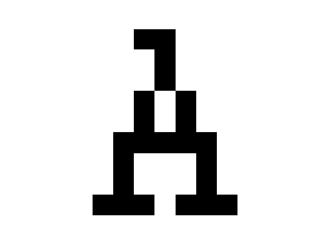
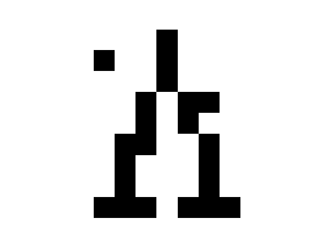
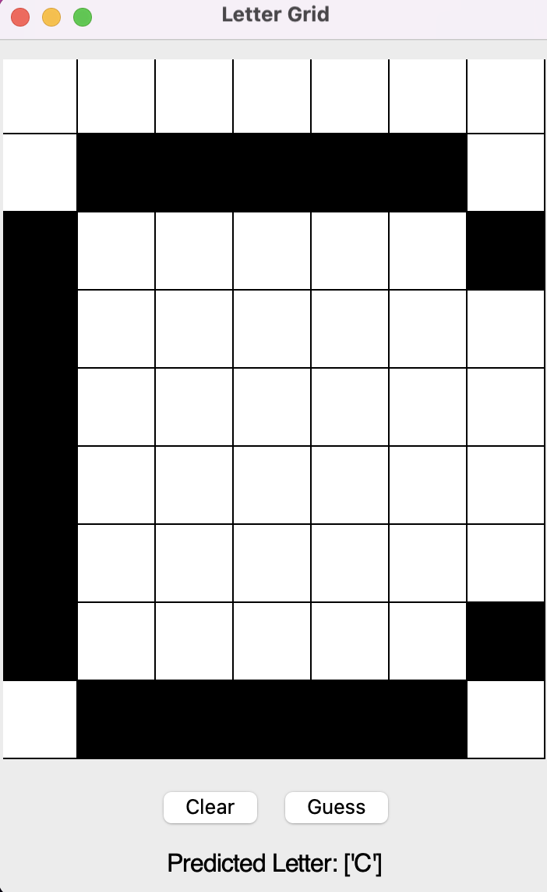

# Character Recognition Using Perceptron

This project implements a single-layer perceptron for recognizing characters represented as bipolar patterns, based on Example 2.14 from Fundamentals of Neural Networks by Laurene Fausett (pp. 71–76). The perceptron is trained using the standard learning rule to adjust its weights and correctly classify input patterns corresponding to the letters A, B, C, D, E, J, and K.

The implementation is written in Python using NumPy and demonstrates how a perceptron can learn to distinguish character patterns, even when presented with variations from different fonts. It provides a clear, hands-on example of fundamental neural network learning principles and can be easily explored in a Jupyter Notebook for educational purposes.

---

## 1. Training the Perceptron

The perceptron is trained using 21 patterns (3 variations for each of 7 letters: A, B, C, D, E, J, K).  

  
*Illustration of training process (weights updating, convergence).*

---

## 2. Playing Around with Noises

Here we add random noise to a letter and see if the perceptron can still recognize it.  

<table>
<tr>
  <td align="center">
    Original letter A 
    
  </td>
  <td align="center">
    Letter A with noise 
    
  </td>
</tr>
</table>

As shown above, even with some noise added, the perceptron can often recognize the letter correctly.

---

## 3. Plotting and Guessing

This part allows the user to draw a letter on a grid, plot it, and let the program predict the letter.  

**Example: Letter C guessed by the program:**  
  

The program outputs the predicted letter after analyzing the input grid.

---
